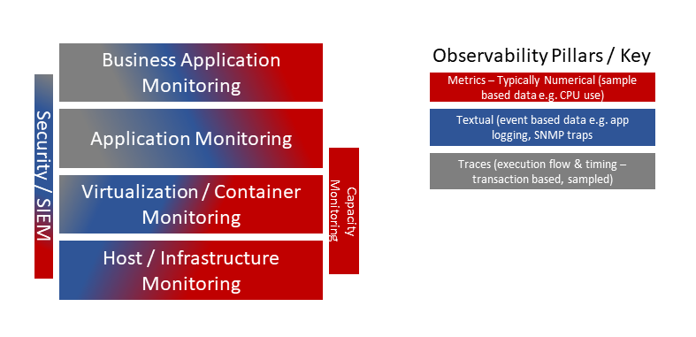

# Monitoring

The capabilities of monitoring can broken into several specific view points:

* Taking raw monitoring data and translating that into actionable data - sometimes that raw data is immediately actionable, but not always
* Types of data and how meaningful information can be derived from it
* The types of actionable insights required

These different view points are underpinned by several axioms:

* [4 Golden Signals of Monitoring](https://landing.google.com/sre/sre-book/chapters/monitoring-distributed-systems/)
* [3 Pillars of Observability](https://medium.com/hepsiburadatech/3-pillars-of-observability-d458c765dd26)

Other development ideals, such as Twelve Factor App contribute to this, but aren't exclusively focused on monitoring. For example [XI](https://12factor.net/logs) in 12 Factor Apps contributes, but is not.

These axioms hold true whether the solutions are delivered through micro-services or monoliths.

## Types of Data

Monitoring of a solution as a component requires the following types of data:

* **Logs** - largely textual, semi structured data produced by application logic.  This can include 'application logic' within the OS for example SNMP traps

* **Traces** - more structural than logs, but less than metrics. Strong Semantic meaning, although constrained is scope. The tracking of transactions through a solution regardless of whether it is a monolith, distributed (choregraphed) or highly parallelized or distributed (e.g.. reactive and microservice deployment models).  In the world of Oracle SOA-Suite this is embodied by ECID and can be extended with BAM when combined with business transaction data, in microservices this is achieved with [Open Tracing](https://opentracing.io/).
* **Metrics** - purely numerical data, typically over time representing counts or percentage usage figures, typically used with the the health and use of the infrastructure (virtual or real)

The role an individual plays within the delivery and operation of a solution will change the emphasis and likely preference of the data in each of these categories.

# Handling of Monitoring Data

The handling of monitoring data can be represented as a series of steps. These steps take the monitoring data and enable it to become a wholistic actionable view. 

Depending upon the technology stack(s) involved this maybe combined into a single tool and potentially a single operation. However a unified approach is not always possible or preferable, as a result of factors such as:

* more complex environments where DevOps / DevSecOps is not practised, different teams may perform specific roles as a result different tools and techniques maybe used.
* In a DevOps based organizations an end to end solution will cross the boundary of multiple teams potentially using different stacks, resulting in operational tooling that differ reflecting the stack being used

However, end to end visibility needs to be obtainable, as a business works this way, and compliance requirements and impacts are managed at the enterprise level, therefore the operational state and issues need to also be understood at this level.

# Core Capabilities

The capabilities are easiest segmented up by the type of data - as this dictates the kinds of processes that can be performed.  There are common capabilities need across all data types as well.

## Common Capabilities regardless of data type:

* Visualization of the data
  * As a time series over different periods.
  * filter out / compress in boundary data points so that outliers are easy to observe.
  * Interrogate Visualization to get the and use the raw data as inputs into mining other structured and semi-structured data.
  * Ability to visual different data streams side by side or overplayed to see comparisons.
* Search
  * Search by time frame
  * Search by content (inferring meaning or via explicit tags/labels/attributes/element definitions e.g. text within a log, or a specific tag/element name)
  * pattern analysis
* Tag the data with additional information or meaning - e.g. labelling a set of data values that are associated with a particular event - for example a system managed shutdown
* Data time stamped to a clock that is synchronized across all components in the system - so time series data can be aligned
* Manage data retention
  * 	purging data as doesn't represent any anomalies
  * 	aggregating values to provide condensed representations of norms
  * 	capture and retain information relating to anomalies / unexpected events
* Make it easy to traverse from operational insights to operational tasks / remediation activities that need to be performed

## Capabilities related to Logs

* Log management

  * Apply meaning to Log Data -  by apply structural meaning to the data, teasing out values, or translating a combination of messages with an error code representation
  * search Of Textual Log Data - ability to identify based on patterns log entries
  * Locate and mask sensitive data that may find its way into the logs
  * combine time series metrics with logs and visualize
  * Filter out unwanted log entries
* Probe the application to get status and health information e.g.

  * Kubernetes checks for liveness and readiness (see [here](https://github.com/k8spatterns/examples/blob/master/foundational/HealthProbe/README.adoc))
  * JMX
* Support notifications such that ...

  * Notifications can be sent to a wide range of notification mechanisms from email, instant messaging to communicating with tools to workflow the management of issues, scheduling call outs.
  * Ability to incorporate data from the monitoring tools into the notifications to provide context.
  * Ability to prevent notification saturation - i.e. if multiple events occur, then only the 1st occurrence triggers notifications.
  * Trigger other processes - such as the ability to perform self healing / autoscaling etc
* Capture events logged reflecting activity / actions within the environment from infrastructure to the business perspectives of an application
* filtering based on log entry characteristics
## Capabilities related to Tracing

* Capture trace data to allow...
  * tracking of transactions as they pass through different components / systems
* Definable scopes for measurement
  * define sub transactional scopes
* pull log and metric data together relating to transactions (correlation)
  * Associate trace information  to performance metrics e.g. latency / response times
* auto instrumentation - so scopes for DB calls for example are automatically recorded
* based on trace entry characteristics
* associate additional metadata to traces

## Capabilities related to Metric
* Capture resource utilization at different levels from infrastructure (physical or virtual) to process resource allocations (memory, accessible storage)

* Latency and throughput (e.g. network traffic, IOPS)

* Intelligent data retention - so outlier metric values are not smoothed out through data aggregation

  # References

The following references were used by OMESA exclusively for research and example purposes. Credit due to the respective authors & owners of the content.

* [4 Golden Signals of Monitoring](https://landing.google.com/sre/sre-book/chapters/monitoring-distributed-systems/)
* [3 Pillars of Observability](https://medium.com/hepsiburadatech/3-pillars-of-observability-d458c765dd26)
* [Open Group - IT4IT](https://pubs.opengroup.org/it4it/refarch21/IT4ITv2.1.html#_Toc473282522)
* https://opentracing.io/, https://opencensus.io/ & https://opentelemetry.io/
* https://blog.risingstack.com/monitoring-nodejs-applications-nodejs-at-scale/
* [Node.JS monitoring practices](https://hackernoon.com/node-js-monitoring-done-right-70418ecbbff9)